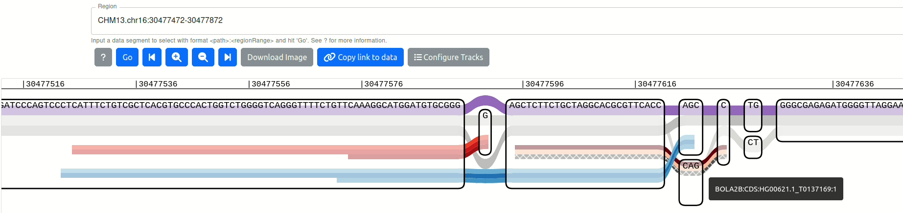
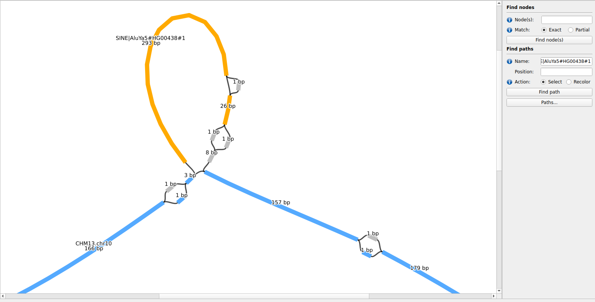

# GAF annotation experiment for the HPRC 2023 Annual Meeting

This repo describes an experiment to use GAFs to represent annotations in a pangenome graph.

A genomic range can be represented as a path in the pangenome. 
The [Graph Alignment Format (GAF) text format](https://github.com/lh3/gfatools/blob/master/doc/rGFA.md#the-graph-alignment-format-gaf), which was proposed to represent alignments, could be used to represent any type of annotation in a pangenome graph. 
To explore this approach within the vg toolkit, two subcommands were updated: 

- `vg gamsort` to sort and index bgzipped GAF files
- `vg annotate` to project annotation on the latest HPRC pangenomes.

Disclaimer: this is still experimental. The goal is to see what we can do already with minimal development. Multiple parts of the analysis below could be improved to make the whole process easier and the results more useful.

- [Tools/dependencies](#toolsdependencies)
- [Experiment on the HPRC pangenome](#experiment-on-the-hprc-pangenome)
    - [Annotation data](#annotation-data)
    - [Pangenome](#pangenome)
- [Workflow](#workflow)
    - [Pre-processing of the annotation files](#pre-processing-of-the-annotation-files)
- [Visualization](#visualization)
  
## Tools/dependencies

- [vg](https://github.com/vgteam/vg)
    - The *gafidx* branch contains code to sort/index GAF files and annotate BED/GFF3 on the HPRC pangenomes
    - A docker container with this version is available at: `quay.io/jmonlong/vg:gafidx`
- For the visualization
    - [sequenceTubeMap](https://github.com/vgteam/sequenceTubemap)
        - The *gafsupport* branch contains preliminary code to make sequenceTubeMap read GAF files.
        - A docker container with this version is available at: `quay.io/jmonlong/sequencetubemap:gaf`
    - [Bandage](https://github.com/rrwick/Bandage)
        - We used v2022.09 of the forked version that can handle paths in GAF files: https://github.com/asl/BandageNG
- For the workflow
    - [Snakemake](snakemake.readthedocs.io/)
        - The pipeline was implemented in Snakemake. It uses the vg docker container mentioned above.
    - [Singularity](https://docs.sylabs.io/guides/3.0/user-guide/installation.html), used by Snakemake to run tasks within docker containers.
    - Python3 to run the pre-processing script.


## Experiment on the HPRC pangenome

### Annotation data

For this experiment, we worked with annotations produced for each assembled haplotype of the HPRC freeze 1.
These are the haplotypes present in the pangenome (see below).
An index of the paths for each annotation file is available at [https://github.com/human-pangenomics/HPP_Year1_Assemblies/tree/main/annotation_index](https://github.com/human-pangenomics/HPP_Year1_Assemblies/tree/main/annotation_index).

We tested the pipeline on:

- BED files annotating segmental duplications, tandem repeats, and RepeatMasker-annotated repeats
- GFF3 files for the gene annotation (from CAT)

```sh
wget https://raw.githubusercontent.com/human-pangenomics/HPP_Year1_Assemblies/main/annotation_index/Year1_assemblies_v2_genbank_Seg_Dups.index
wget https://raw.githubusercontent.com/human-pangenomics/HPP_Year1_Assemblies/main/annotation_index/Year1_assemblies_v2_genbank_TRF.index
wget https://raw.githubusercontent.com/human-pangenomics/HPP_Year1_Assemblies/main/annotation_index/Year1_assemblies_v2_genbank_Repeat_Masker.index
wget https://raw.githubusercontent.com/human-pangenomics/HPP_Year1_Assemblies/main/annotation_index/Year1_assemblies_v2_genbank_CAT_genes.index
```

### Pangenome

We used the CHM13-based Minigraph-Cactus pangenome (freeze 1).
It contains all the haplotypes as paths, has base-level resolution, and was known to be compatible with the vg toolkit.

The pangenome is available at [https://s3-us-west-2.amazonaws.com/human-pangenomics/index.html?prefix=pangenomes/freeze/freeze1/minigraph-cactus/](https://s3-us-west-2.amazonaws.com/human-pangenomics/index.html?prefix=pangenomes/freeze/freeze1/minigraph-cactus/).

The different indexes will be downloaded by the Snakemake pipeline described below.
To download them manually:

```sh
wget https://s3-us-west-2.amazonaws.com/human-pangenomics/pangenomes/freeze/freeze1/minigraph-cactus/hprc-v1.0-mc-chm13.xg
wget https://s3-us-west-2.amazonaws.com/human-pangenomics/pangenomes/freeze/freeze1/minigraph-cactus/hprc-v1.0-mc-chm13.gbwt
```

## Workflow

A workflow was implemented in Snakemake to annotate the different annotations on all the haplotypes. 
Under the hood, the workflow:

1. prepares the pangenomes
2. pre-processes the annotation files
3. projects the annotation onto the pangenome (`vg annotate`)
4. sorts and indexes the pangenomic annotations (`vg gamsort`)

For example, assuming the full pangenome GBZ file and raw annotations are locally available, the commands might look like:

```sh 
## add the haplotype as a refernece path in the GBZ
vg gbwt -Z --set-tag "reference_samples=HG00438" --gbz-format -g gbz/HG00438.hprc-v1.0-mc-chm13.gbz hprc-v1.0-mc-chm13.gbz
## pre-process annotation
python3 pre-vg-annotate.py -i raw_annotation/HG00438.1.chm13.gff3.gz --add-prefix HG00438#1# --use-name-id | gzip > prep_annotation/gene_HG00438.1.gff3.gz
## project annotation onto pangenome
gunzip -c prep_annotation/gene_HG00438.1.gff3.gz | vg annotate -x gbz/HG00438.hprc-v1.0-mc-chm13.gbz -f - | vg convert -G - gbz/HG00438.hprc-v1.0-mc-chm13.gbz | gzip > unsorted_gaf/gene_HG00438.1.gaf.gz
## sort GAF
vg gamsort -t 1 -pG unsorted_gaf/gene_HG00438.1.gaf.gz | bgzip > gaf/gene_HG00438.1.gaf.gz
## index GAF
tabix -p gaf gaf/gene_HG00438.1.gaf.gz
```

To run the workflow:

```sh
snakemake -p --use-singularity
```

For information, [`dryrun-snakemake-one-haplotype.log`](dryrun-snakemake-one-haplotype.log) and [`dryrun-snakemake-all-haplotypes.log`](dryrun-snakemake-all-haplotypes.log) show the commands run by the workflow to annotate one or all haplotypes.

Of note, workflow includes ressources that can be used by SLURM. 
Add `--slurm --latency-wait 30 --jobs 10`, for example, to the snakemake command above to run in SLURM systems.

### Pre-processing of the annotation files

Ideally, we would record relevant metadata in the GAF file. 
For example, haplotype of origin, element name and additional information (e.g. gene type, annotation type, repeat class).
In practice, the current implementation of `vg annotate` only saves one read/path/annotation "name" per annotation. 
The most relevant information was then crammed into this "name" by modifying the raw annotation files before projection to the pangenome.
The annotation files were modified using the ([`pre-vg-annotate.py`](pre-vg-annotate.py)) python script to:

- Rename the elements so that it includes the haplotype of origin. This will later help differentiating the same genes/repeats/etc from different haplotypes.
- Create more descriptive names (for repeats).
- Add a prefix to the contig names to match the haplotype names in the pangenome (usually adding `{SAMPLE}#{HAP}#`), if needed.

#### Pre-process gene annotation from CAT

```sh
python3 pre-vg-annotate.py -i {input} --add-prefix {pref} --use-name-id | gzip > {output}
```

where:

- `{pref}` is the haplotype name prefix (e.g. `HG00438#1#`) to add to the contig names.
- `--use-name-id` to replace the *Name* value with the value of *Name* and *ID*, seprated by a `:`. For example, the CAT annotations have `ID=HG00438.1_G0000001;Name=WASHC1` which will be changed to `ID=HG00438.1_G0000001;Name=WASHC1:HG00438.1_G0000001`. 

#### Pre-process tandem repeats from TRF

```sh
python3 pre-vg-annotate.py -i {input} --add-suffix "{suff}" --add-rep-n | gzip > {output}
```

where: 

- `{suff}` is the haplotype name suffix (e.g. `#HG00438#1`) to add to the repeat name.
- `--add-rep-n` to format the repeat names as `(<MOTIF>)<N>`

#### Pre-process segmental duplications

```sh
python3 pre-vg-annotate.py -i {input} --add-suffix "{suff}" --add-len-fracm | gzip > {output}
```

where: 

- `{suff}` is the haplotype name suffix (e.g. `#HG00438#1`) to add to the SD name.
- `--add-len-fracm` to name the SD as `<LENGTH>bp_<FRACMATCH>`

#### Pre-process RepeatMasker annotation

```sh
python3 pre-vg-annotate.py -i {input} --add-suffix "{suff}" --add-rm-class | gzip > {output}
```

where: 

- `{suff}` is the haplotype name suffix (e.g. `#HG00438#1`) to add to the SD name.
- `--add-rm-class` to prefix the repeat name with its class

## Visualization

### sequenceTubeMap

Using sequenceTubeMap, haplotypes, read alignments and paths can be visualized interactively. Hovering on a path displays its name, here the ID of a coding region of the BOLA2B gene. 

In the example below, the CHM13 haplotype is represented in purple, and the two haplotypes from HG00621 in greys.
The red and blue paths represents annotated coding sequence (CDS) for haplotype 1 and 2, respectively.



This visualization highlights the different CDS in the two haplotype and the variation that are responsible.
Different regions can be queried efficiently thanks to the sorting and indexing of the annotation files.

Assuming the pangenome and sorted/indexed GAF files are in the working directory, launch the sequenceTubeMape with:

```sh
docker run -it -v `pwd`:/data -p 3000:3000 quay.io/jmonlong/sequencetubemap:gaf
```

Then open a browser at http://localhost:3000/.

Of note, it might 

```sh
vg paths -S HG00621 -g hprc-v1.0-mc-chm13.gbwt -x hprc-v1.0-mc-chm13.xg -A | gzip > HG00621.haps.gaf.gz
vg convert -p hprc-v1.0-mc-chm13.xg | vg augment -B -F - HG00621.haps.gaf.gz > hprc-v1.0-mc-chm13.HG00621.vg
vg index -x hprc-v1.0-mc-chm13.HG00621.xg hprc-v1.0-mc-chm13.HG00621.vg
```

### Bandage

Using BandageNG, a fork that can import paths in GAF files, paths were searched and colored to illustrate a mobile element insertion. 

In the example below, the CHM13 haplotype is colored in blue in purple, and an AluYa5 on haplotype 1 of HG00438 in yellow.
Thanks to the annotation we see that this non-reference sequence is likely a mobile element insertion.



The subgraph of this region was extracted manually using:

```sh
## extract region around chr10:68739021 (context: 10 nodes)
vg chunk -p CHM13.chr10:68739021 -c 10 -x hprc-v1.0-mc-chm13.xg -g -F -a rm_HG00438.1.gaf.gz > graph.vg
## convert pangenome to GFA
## Bandage seems to prefer when the P lines defining the paths are at the end
vg view graph.vg | grep -v -P "P\t" > graph.gfa
vg view graph.vg | grep -P "P\t" >> graph.gfa
## select Alu annotation and remove optional tags that Bandage doesn't seem to handle
grep Alu chunk_0_CHM13.chr10_68738288_68739893.gaf | cut -f1-12 > annot.gaf
```

Open BandageNG, "Load graph" (`graph.gfa`), "Draw graph", Load paths (`annot.gfa`).
In the right panel, paths can then be listed ("Paths..."), searched in the *Name:* field.
For example, search for "SINE|AluYa5#HG00438#1" and use "Set colour"/"Set label" to highlight the path.
